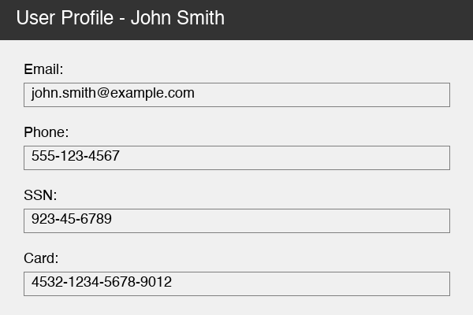
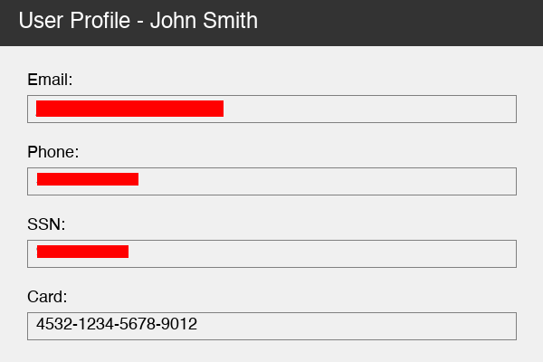

# openadapt-privacy

> [!IMPORTANT]
> **Status: Experimental.** The API is published on the 1.x version line, but
> the PHI/PII detector is backed by synthetic regression evidence rather than
> clinical validation. Scrubbing is one control in a reviewed egress process,
> not a guarantee that an artifact is free of protected data.
>
> The OpenAdapt product is the demonstration compiler,
> [`openadapt-flow`](https://github.com/OpenAdaptAI/openadapt-flow), installed
> via the [`OpenAdapt`](https://github.com/OpenAdaptAI/OpenAdapt) launcher
> (`pip install openadapt`): it compiles a demonstrated GUI workflow into a
> deterministic, locally executable program. Healthy runs make no model calls,
> and it halts instead of guessing when verification fails. Lifecycle labels for
> every repository are in the
> [repository lifecycle registry](https://github.com/OpenAdaptAI/.github/blob/main/REPOSITORY_LIFECYCLE.md).

[](https://github.com/OpenAdaptAI/openadapt-privacy/actions)
[](https://pypi.org/project/openadapt-privacy/)
[](https://pypi.org/project/openadapt-privacy/)
[](https://opensource.org/licenses/MIT)
[](https://www.python.org/downloads/)

PHI/PII detection and redaction for GUI automation data. Presidio-backed
scrubbing of the text, structured element trees, and screenshots that a
recording captures.

This is the trust and auditability asset of the OpenAdapt stack. A demonstration
recording can contain everything visible on screen and everything typed, so
`openadapt-privacy` gives the compiler and its operators a reviewable control for
removing protected data before an artifact is stored, shared, or exported. It
detects a fixed set of entity types, replaces them with typed placeholders, and
fails loud when its model is unavailable rather than scrubbing silently weaker.

## The OpenAdapt stack

OpenAdapt is a governed demonstration compiler: record a workflow once, compile
the recording into a deterministic program, and replay that program with zero
model calls on the healthy path. When the live screen does not match what was
demonstrated it halts instead of guessing, using identity gates and independent
effect verification. Every substrate is first-class: web and desktop recording
are validated, RDP and Windows replay are early, and Citrix is exploratory.

| Package | Role |
| --- | --- |
| [`openadapt`](https://github.com/OpenAdaptAI/OpenAdapt) | Launcher and installer (`pip install openadapt`) |
| [`openadapt-flow`](https://github.com/OpenAdaptAI/openadapt-flow) | Records, compiles, verifies, and replays workflows |
| [`openadapt-capture`](https://github.com/OpenAdaptAI/openadapt-capture) | Cross-platform local desktop recording |
| [`openadapt-types`](https://github.com/OpenAdaptAI/openadapt-types) | Canonical action and UI-state schema |
| [`openadapt-grounding`](https://github.com/OpenAdaptAI/openadapt-grounding) | Local OCR text-anchoring plus optional model grounding |
| **`openadapt-privacy`** | PHI/PII detection and redaction (this package) |

Documentation for the whole stack lives at
[docs.openadapt.ai](https://docs.openadapt.ai).

## Installation

```bash
pip install openadapt-privacy
```

For Presidio-based scrubbing (recommended):

```bash
pip install openadapt-privacy[presidio]
python -m spacy download en_core_web_sm
```

### Model security and recall

The Presidio provider accepts only the preinstalled, allowlisted
`en_core_web_sm` pipeline. It never downloads a model at runtime. A missing
model, an unsupported language, or inconsistent model configuration raises
`PrivacyModelUnavailable` before analysis instead of continuing with weaker or
simulated scrubbing.

`tests/test_phi_recall.py` is a quantitative regression gate covering 24
synthetic identifiers across names, contact information, financial identifiers,
dates of birth, addresses, network identifiers, medical record numbers, member
IDs, and provider licenses. The current gate requires 24/24 detections and also
checks clean operational UI text for false positives.

This synthetic corpus is regression evidence, not clinical validation or a
guarantee that an artifact is PHI-free. Production egress should scrub a copy,
verify every output file, and bind human or policy approval to the verified
artifact rather than treating successful model execution as sufficient.

## Quick Start

### Text Scrubbing

```python
from openadapt_privacy.providers.presidio import PresidioScrubbingProvider

scrubber = PresidioScrubbingProvider()

text = "Contact John Smith at john.smith@example.com or 555-123-4567"
scrubbed = scrubber.scrub_text(text)
```

**Input:**
```
Contact John Smith at john.smith@example.com or 555-123-4567
```

**Output:**
```
Contact <PERSON> at <EMAIL_ADDRESS> or <PHONE_NUMBER>
```

### Example Inputs & Outputs

| Input | Output |
|-------|--------|
| `My email is john@example.com` | `My email is <EMAIL_ADDRESS>` |
| `SSN: 923-45-6789` | `SSN: <US_SSN>` |
| `Card: 4532-1234-5678-9012` | `Card: <CREDIT_CARD>` |
| `Call me at 555-123-4567` | `Call me at <PHONE_NUMBER>` |
| `DOB: 01/15/1985` | `DOB: <DATE_TIME>` |
| `Contact John Smith` | `Contact <PERSON>` |

## Dict Scrubbing

Scrub PHI/PII from nested dictionaries (e.g., GUI element trees):

```python
from openadapt_privacy import scrub_dict
from openadapt_privacy.providers.presidio import PresidioScrubbingProvider

scrubber = PresidioScrubbingProvider()
action = {
    "text": "Email: john@example.com",
    "metadata": {
        "title": "User Profile - John Smith",
        "tooltip": "Click to contact john@example.com",
    },
    "coordinates": {"x": 100, "y": 200},
}
scrubbed = scrub_dict(action, scrubber)
```

**Input:**
```json
{
    "text": "Email: john@example.com",
    "metadata": {
        "title": "User Profile - John Smith",
        "tooltip": "Click to contact john@example.com"
    },
    "coordinates": {"x": 100, "y": 200}
}
```

**Output:**
```json
{
    "text": "Email: <EMAIL_ADDRESS>",
    "metadata": {
        "title": "User Profile - <PERSON>",
        "tooltip": "Click to contact <EMAIL_ADDRESS>"
    },
    "coordinates": {"x": 100, "y": 200}
}
```

## Recording Pipeline

Process complete GUI automation recordings:

```python
from openadapt_privacy import DictRecordingLoader
from openadapt_privacy.providers.presidio import PresidioScrubbingProvider

scrubber = PresidioScrubbingProvider()
loader = DictRecordingLoader()

recording = loader.load_from_dict({
    "task_description": "Send email to John Smith at john@example.com",
    "actions": [
        {"id": 1, "action_type": "click", "text": "Compose", "timestamp": 1000},
        {"id": 2, "action_type": "type", "text": "john@example.com", "timestamp": 2000},
        {"id": 3, "action_type": "click", "text": "Send", "window_title": "Email to john@example.com", "timestamp": 3000},
    ],
})

scrubbed = recording.scrub(scrubber)
```

**Input Recording:**
```
task_description: "Send email to John Smith at john@example.com"

actions:
  [1] click: "Compose"
  [2] type:  "john@example.com"
  [3] click: "Send" (window: "Email to john@example.com")
```

**Output Recording:**
```
task_description: "Send email to <PERSON> at <EMAIL_ADDRESS>"

actions:
  [1] click: "Compose"
  [2] type:  "<EMAIL_ADDRESS>"
  [3] click: "Send" (window: "Email to <EMAIL_ADDRESS>")
```

## Image Scrubbing

Redact PHI/PII from screenshots using OCR + NER:

```python
from PIL import Image
from openadapt_privacy.providers.presidio import PresidioScrubbingProvider

scrubber = PresidioScrubbingProvider()

image = Image.open("screenshot.png")
scrubbed_image = scrubber.scrub_image(image)
scrubbed_image.save("screenshot_scrubbed.png")
```

**Input Screenshot:**



**Output Screenshot:**



The image redactor:
1. Runs OCR to detect text regions
2. Analyzes text for PII entities (email, phone, SSN, etc.)
3. Fills detected PII regions with solid color (configurable, default: red)

## Custom Data Loader

Implement your own loader for custom storage formats:

```python
from openadapt_privacy import RecordingLoader, Recording

class SQLiteRecordingLoader(RecordingLoader):
    def __init__(self, db_path: str):
        self.db_path = db_path

    def load(self, recording_id: str) -> Recording:
        # Load from SQLite database
        ...

    def save(self, recording: Recording, recording_id: str) -> None:
        # Save to SQLite database
        ...

# Usage
loader = SQLiteRecordingLoader("recordings.db")
scrubber = PresidioScrubbingProvider()

# Load, scrub, and save
scrubbed = loader.load_and_scrub("recording_001", scrubber)
loader.save(scrubbed, "recording_001_scrubbed")
```

## Configuration

```python
from openadapt_privacy.config import PrivacyConfig

custom_config = PrivacyConfig(
    SCRUB_CHAR="X",                    # Character for scrub_text_all
    SCRUB_FILL_COLOR=0xFF0000,         # Red for image redaction (BGR)
    SCRUB_KEYS_HTML=[                  # Keys to scrub in dicts
        "text", "value", "title", "tooltip", "custom_field"
    ],
    SCRUB_PRESIDIO_IGNORE_ENTITIES=[   # Entity types to skip
        "DATE_TIME",
    ],
)
```

## Supported Entity Types

| Entity | Example Input | Example Output |
|--------|---------------|----------------|
| `PERSON` | `John Smith` | `<PERSON>` |
| `EMAIL_ADDRESS` | `john@example.com` | `<EMAIL_ADDRESS>` |
| `PHONE_NUMBER` | `555-123-4567` | `<PHONE_NUMBER>` |
| `US_SSN` | `923-45-6789` | `<US_SSN>` |
| `CREDIT_CARD` | `4532-1234-5678-9012` | `<CREDIT_CARD>` |
| `US_BANK_NUMBER` | `635526789012` | `<US_BANK_NUMBER>` |
| `US_DRIVER_LICENSE` | `A123-456-789-012` | `<US_DRIVER_LICENSE>` |
| `DATE_TIME` | `01/15/1985` | `<DATE_TIME>` |
| `LOCATION` | `Toronto, ON` | `<LOCATION>` |

## Architecture

```
openadapt_privacy/
├── base.py           # ScrubbingProvider, TextScrubbingMixin
├── config.py         # PrivacyConfig dataclass
├── loaders.py        # Recording, Action, Screenshot, RecordingLoader
├── providers/
│   ├── __init__.py   # ScrubProvider registry
│   └── presidio.py   # PresidioScrubbingProvider
└── pipelines/
    └── dicts.py      # scrub_dict, scrub_list_dicts
```

## License

MIT
