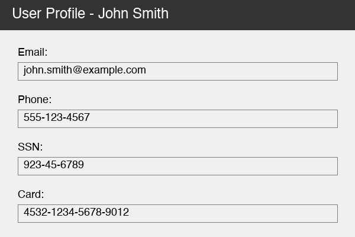
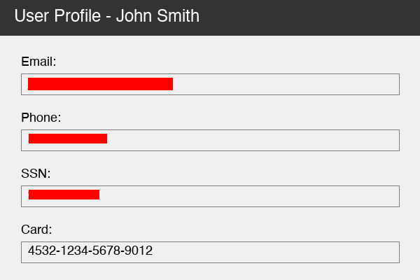

# openadapt-privacy

[](https://github.com/OpenAdaptAI/openadapt-privacy/actions)
[](https://pypi.org/project/openadapt-privacy/)
[](https://www.python.org/downloads/)
[](https://opensource.org/licenses/MIT)

Finds and removes personal and health data from GUI automation artifacts: the
text a recording captured, the element trees around it, and the screenshots.
Presidio does the detection; this package wires it to the shapes a recording
actually has.

A demonstration recording contains everything that was on screen and everything
that was typed. So before you store one, share one, or export one, something
has to strip the identifiers out, and that something needs to fail loudly when
it can't. That's this.

[Documentation](https://docs.openadapt.ai) ·
[openadapt-flow](https://github.com/OpenAdaptAI/openadapt-flow) ·
[Repository lifecycle](https://github.com/OpenAdaptAI/.github/blob/main/REPOSITORY_LIFECYCLE.md)

## Install

```bash
pip install "openadapt-privacy[presidio]"
python -m spacy download en_core_web_sm
```

The Presidio provider takes only the preinstalled, allowlisted `en_core_web_sm`
pipeline and never downloads a model at runtime. A missing model, an
unsupported language, or an inconsistent configuration raises
`PrivacyModelUnavailable` before analysis starts, rather than quietly scrubbing
worse than you expected.

## Read this before you rely on it

Scrubbing is one control inside a reviewed egress process. It is not a
guarantee that an artifact is free of protected data, and the evidence behind
it is synthetic, not clinical.

`tests/test_phi_recall.py` is the regression gate: 24 synthetic identifiers
across names, contact details, financial identifiers, dates of birth,
addresses, network identifiers, medical record numbers, member IDs, and
provider licenses. It requires 24 out of 24, and it also checks that ordinary
operational UI text comes back untouched.

Detection is contextual, so the same value scrubs differently depending on what
surrounds it. Every output below was produced by running 1.0.3 on 2026-08-28,
not written by hand. Some of it will surprise you:

```python
>>> from openadapt_privacy.providers.presidio import PresidioScrubbingProvider
>>> s = PresidioScrubbingProvider()

>>> s.scrub_text("Patient John Smith, john.smith@example.com, 555-123-4567, SSN 923-45-6789")
'Patient <PERSON>, <EMAIL_ADDRESS>, <PHONE_NUMBER>, <ORGANIZATION> <US_SSN>'

>>> s.scrub_text("SSN: 923-45-6789")
'<ORGANIZATION>: <US_SSN>'

>>> s.scrub_text("Card 4111111111111111 on file")
'<DATE_TIME> on file'
```

The last one is the important one. A card number gets redacted, but as
`DATE_TIME`, not as `CREDIT_CARD`, and the label "Card" goes with it. The
redaction holds; the entity type you get back is not the one you would predict.
Do not build a policy that keys off the placeholder name without measuring it
against your own data first.

For production egress: scrub a copy, verify every output file, and bind the
human or policy approval to the verified artifact. A model that ran without
error is not evidence that the artifact is clean.

## Scrubbing text

```python
from openadapt_privacy.providers.presidio import PresidioScrubbingProvider

scrubber = PresidioScrubbingProvider()
scrubber.scrub_text("Contact John Smith at john.smith@example.com or 555-123-4567")
# 'Contact <PERSON> at <EMAIL_ADDRESS> or <PHONE_NUMBER>'
```

## Scrubbing nested dicts

For element trees and event payloads:

```python
from openadapt_privacy import scrub_dict
from openadapt_privacy.providers.presidio import PresidioScrubbingProvider

scrubber = PresidioScrubbingProvider()
scrub_dict(
    {
        "title": "User Profile - John Smith",
        "tooltip": "Click to contact john@example.com",
        "value": "Call 555-123-4567",
        "coordinates": {"x": 100, "y": 200},
    },
    scrubber,
)
```

```json
{
    "title": "User Profile - <PERSON>",
    "tooltip": "Click to contact <EMAIL_ADDRESS>",
    "value": "Call <PHONE_NUMBER>",
    "coordinates": {"x": 100, "y": 200}
}
```

Only the keys in `PrivacyConfig.SCRUB_KEYS_HTML` are scrubbed, and non-string
values pass through, which is why the coordinates survive. Pass `scrub_all=True`
to scrub every string regardless of key.

One caveat in 1.0.3: the `text` key is treated as character-separated action
text, joined by `ACTION_TEXT_SEP` (`-`). Scrubbing a plain sentence under that
key returns it hyphenated, one character at a time. Use `value` or `title` for
ordinary prose until that's fixed.

## Scrubbing screenshots

```python
from PIL import Image
from openadapt_privacy.providers.presidio import PresidioScrubbingProvider

scrubber = PresidioScrubbingProvider()
scrubbed = scrubber.scrub_image(Image.open("screenshot.png"))
scrubbed.save("screenshot_scrubbed.png")
```




OCR finds the text regions, the analyzer classifies them, and the detected
regions get filled with a solid colour (`SCRUB_FILL_COLOR`, red by default).
Anything OCR misses is not redacted.

## Whole recordings

`DictRecordingLoader` takes a recording as a dict and scrubs the task
description and every action together:

```python
from openadapt_privacy import DictRecordingLoader
from openadapt_privacy.providers.presidio import PresidioScrubbingProvider

recording = DictRecordingLoader().load_from_dict({
    "task_description": "Send email to John Smith at john@example.com",
    "actions": [
        {"id": 1, "action_type": "click", "text": "Compose", "timestamp": 1000},
        {"id": 2, "action_type": "click", "text": "Send",
         "window_title": "Email to john@example.com", "timestamp": 3000},
    ],
})
scrubbed = recording.scrub(PresidioScrubbingProvider())
```

Subclass `RecordingLoader` for your own storage. Implement `load` and `save`,
and you get `load_and_scrub` for free:

```python
from openadapt_privacy import RecordingLoader, Recording

class SQLiteRecordingLoader(RecordingLoader):
    def load(self, recording_id: str) -> Recording: ...
    def save(self, recording: Recording, recording_id: str) -> None: ...
```

## Configuration

```python
from openadapt_privacy.config import PrivacyConfig

PrivacyConfig(
    SCRUB_CHAR="X",                                  # for scrub_text_all
    SCRUB_FILL_COLOR=0xFF0000,                       # image redaction, BGR
    SCRUB_KEYS_HTML=["text", "value", "title", "tooltip"],
    SCRUB_PRESIDIO_IGNORE_ENTITIES=["DATE_TIME"],
)
```

The full field list is `SCRUB_CHAR`, `SCRUB_LANGUAGE`, `SCRUB_FILL_COLOR`,
`SCRUB_KEYS_HTML`, `ACTION_TEXT_NAME_PREFIX`, `ACTION_TEXT_NAME_SUFFIX`,
`ACTION_TEXT_SEP`, `SCRUB_CONFIG_TRF`, `SCRUB_PRESIDIO_IGNORE_ENTITIES`, and
`SPACY_MODEL_NAME`.

The analyzer's supported entity set comes from Presidio: `CREDIT_CARD`,
`CRYPTO`, `DATE_TIME`, `EMAIL_ADDRESS`, `IBAN_CODE`, `IP_ADDRESS`, `LOCATION`,
`MAC_ADDRESS`, `MEDICAL_LICENSE`, `NRP`, `PERSON`, `PHONE_NUMBER`, `UK_NHS`,
`URL`, `US_BANK_NUMBER`, `US_DRIVER_LICENSE`, `US_ITIN`, `US_PASSPORT`,
`US_SSN`, plus `ORGANIZATION` from the spaCy pipeline. Which one fires on a
given string depends on the text around it, so measure rather than assume.

## Layout

```
openadapt_privacy/
├── base.py           # ScrubbingProvider, TextScrubbingMixin
├── config.py         # PrivacyConfig
├── loaders.py        # Recording, Action, Screenshot, RecordingLoader
├── providers/
│   └── presidio.py   # PresidioScrubbingProvider
└── pipelines/
    └── dicts.py      # scrub_dict, scrub_list_dicts
```

## License

[MIT](LICENSE)
